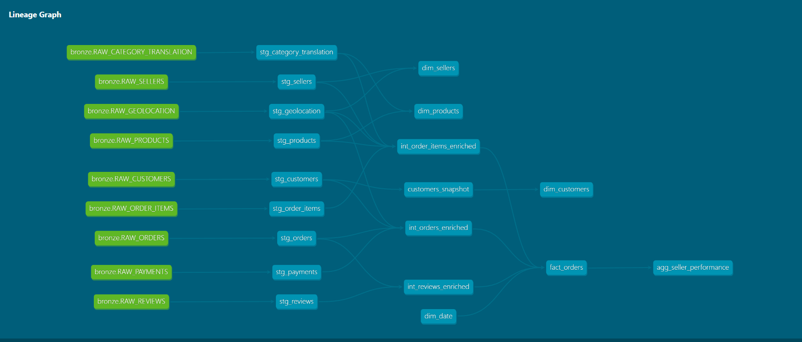

# ❄️ Snowflake Supply Chain Analytics

<div align="center">


**End-to-end supply chain analytics pipeline built on free-tier tools — replicating enterprise Medallion Architecture with Databricks, Snowflake, and dbt.**

[Architecture](#-architecture) • [Tech Stack](#-tech-stack) • [Pipeline](#-pipeline-overview) • [Project Structure](#-project-structure)

</div>

---

## 📌 Project Overview

This project builds a **production-grade data pipeline** for e-commerce supply chain analytics using the **Olist Brazilian E-commerce dataset** (~1.5M rows across 9 source tables).

The architecture mirrors real enterprise patterns used in large-scale distribution and supply chain companies — **Medallion Architecture (Bronze → Silver → Gold)**, incremental loads, SCD Type 2 history tracking, and a Star Schema serving layer — implemented entirely on free-tier tools.

| Metric | Value |
|---|---|
| Source Tables | 9 |
| Total Raw Rows | 1,555,860 |
| Fact Table Rows | 261,033 |
| dbt Models | 18 |
| dbt Tests | 30+ |
| Pipeline Layers | Bronze → Silver → Gold |

---

## 🏗️ Architecture

```
┌─────────────────────────────────────────────────────────────────┐
│                        SOURCE LAYER                             │
│         Olist E-commerce Dataset (Kaggle) — 9 CSV files         │
└─────────────────────────┬───────────────────────────────────────┘
                          │  PySpark ingestion
                          ▼
┌─────────────────────────────────────────────────────────────────┐
│                    DATABRICKS (Serverless)                       │
│   Schema validation · Metadata columns · Snowflake connector    │
└─────────────────────────┬───────────────────────────────────────┘
                          │  write_pandas() → Snowflake
                          ▼
┌─────────────────────────────────────────────────────────────────┐
│                  SNOWFLAKE — BRONZE SCHEMA                       │
│         Raw as-landed tables · No transformations               │
│  RAW_ORDERS · RAW_CUSTOMERS · RAW_ORDER_ITEMS · RAW_PRODUCTS    │
│  RAW_SELLERS · RAW_PAYMENTS · RAW_REVIEWS · RAW_GEOLOCATION     │
└─────────────────────────┬───────────────────────────────────────┘
                          │  dbt staging models
                          ▼
┌─────────────────────────────────────────────────────────────────┐
│                  SNOWFLAKE — SILVER SCHEMA                       │
│     Cleaned · Type-cast · Validated · SCD Type 2 Snapshot       │
│  stg_orders · stg_customers · stg_order_items · stg_products    │
│  stg_sellers · stg_payments · stg_reviews · stg_geolocation     │
│  int_orders_enriched · int_order_items_enriched                  │
│  int_reviews_enriched · customers_snapshot (SCD Type 2)          │
└─────────────────────────┬───────────────────────────────────────┘
                          │  dbt mart models
                          ▼
┌─────────────────────────────────────────────────────────────────┐
│                   SNOWFLAKE — GOLD SCHEMA                        │
│              Star Schema · Analytics Ready                       │
│                                                                  │
│   dim_customers   dim_products   dim_sellers   dim_date          │
│                        │                                         │
│                   fact_orders                                    │
│                        │                                         │
│              agg_seller_performance                              │
└─────────────────────────────────────────────────────────────────┘
```

---

## 🛠️ Tech Stack

| Layer | Tool | Purpose |
|---|---|---|
| Ingestion | Databricks (Serverless) + PySpark | Read CSVs, validate schema, load to Bronze |
| Storage | Snowflake (ADLS Gen2 backed) | All 3 Medallion layers |
| Transformation | dbt Core 1.11 | Silver + Gold layer models |
| SCD Type 2 | dbt Snapshots | Customer history tracking |
| Testing | dbt Tests | Data quality enforcement |
| Version Control | Git + GitHub | Full project history |
| Language | Python + SQL (Jinja) | Pipeline and transformation logic |

---

## 🔄 Pipeline Overview

### Phase 1 — Snowflake Setup
- Dedicated warehouses (`TRANSFORM_WH`, `ANALYST_WH`) with auto-suspend
- Role-based access control (`ENGINEER_ROLE`, `ANALYST_ROLE`)
- Medallion schema isolation (`BRONZE`, `SILVER`, `GOLD`)
- Future grants for automatic permission inheritance

### Phase 2 — Databricks Ingestion
- PySpark reads 9 CSV files from Databricks Volume
- Schema validation and null checks per table
- Metadata columns added (`_ingested_at`, `_source_file`, `_pipeline_name`)
- Bulk load to Snowflake Bronze via `write_pandas()` with `auto_create_table`

### Phase 3 — dbt Silver Layer
- **9 staging models** — type casting, cleaning, deduplication
- **3 intermediate models** — business logic joins, payment aggregation, geolocation enrichment
- **SCD Type 2 snapshot** on `customers` tracking city/state changes over time
- `generate_schema_name` macro overriding default dbt schema naming

### Phase 4 — dbt Gold Layer (Star Schema)
- `fact_orders` — central fact table, 261K rows, one row per order line item
- `dim_customers` — pulls current record from SCD Type 2 snapshot
- `dim_products` — English category names via Portuguese→English translation join
- `dim_sellers` — with geolocation lat/long
- `dim_date` — generated date spine covering 2016–2022
- `agg_seller_performance` — monthly seller KPIs ready for dashboarding

### Phase 5 — Testing + Documentation
- 30+ dbt tests: `unique`, `not_null`, `accepted_values`, `relationships`
- Full dbt docs with model descriptions and column-level documentation
- DAG lineage graph showing complete dependency chain

---

## 📁 Project Structure

```
snowflake-supply-chain-analytics/
│
├── 01_ingestion/
│   └── 01_raw_ingest_and_load.ipynb      # PySpark ingestion notebook
│
├── 02_dbt_project/
│   ├── models/
│   │   ├── staging/
│   │   │   ├── sources.yml               # Bronze source definitions
│   │   │   ├── schema.yml                # Staging tests + docs
│   │   │   ├── stg_orders.sql
│   │   │   ├── stg_customers.sql
│   │   │   ├── stg_order_items.sql
│   │   │   ├── stg_products.sql
│   │   │   ├── stg_sellers.sql
│   │   │   ├── stg_payments.sql
│   │   │   ├── stg_reviews.sql
│   │   │   ├── stg_geolocation.sql
│   │   │   └── stg_category_translation.sql
│   │   ├── intermediate/
│   │   │   ├── int_orders_enriched.sql
│   │   │   ├── int_order_items_enriched.sql
│   │   │   └── int_reviews_enriched.sql
│   │   └── marts/
│   │       ├── schema.yml                # Gold tests + docs
│   │       ├── fact_orders.sql
│   │       ├── dim_customers.sql
│   │       ├── dim_products.sql
│   │       ├── dim_sellers.sql
│   │       ├── dim_date.sql
│   │       └── agg_seller_performance.sql
│   ├── snapshots/
│   │   └── customers_snapshot.yml        # SCD Type 2
│   ├── macros/
│   │   └── generate_schema_name.sql      # Custom schema resolution
│   └── dbt_project.yml
│
├── 03_snowflake_setup/
│   ├── 01_warehouses_and_roles.sql
│   └── 02_databases_and_schemas.sql
│
├── 04_docs/
│   ├── architecture_diagram.png
│   └── dbt_lineage_screenshot.png
│
├── .gitignore
├── LICENSE
└── README.md
```

---

## ⚙️ Key Engineering Decisions

**1. Medallion Architecture over flat tables**
Bronze holds raw as-landed data — never modified. Silver applies business logic and cleaning. Gold serves the star schema. This separation means upstream failures never corrupt downstream analytics.

**2. SCD Type 2 on Customer dimension**
Customers can change city or state over time. Using dbt snapshots with `check` strategy on `CUSTOMER_CITY`, `CUSTOMER_STATE`, `CUSTOMER_ZIP_CODE` tracks full history — enabling point-in-time queries like *"where was this customer when they placed this order?"*

**3. Incremental load strategy**
Bronze uses full overwrite (idempotent reload). Silver staging uses dbt table materialization for type safety. Gold uses table materialization for query performance. In production this would extend to incremental models using `MERGE` logic.

**4. Custom `generate_schema_name` macro**
Overrides dbt's default schema concatenation behaviour (`SILVER_SILVER`) to use exact schema names as defined — mirrors enterprise dbt project conventions.

**5. Geolocation deduplication**
Raw geolocation has 1M+ rows with multiple lat/long per zip code. Used `mode()` for city/state and `avg()` for coordinates — reducing to one canonical row per zip code before joining to fact table.

**6. Separated compute warehouses**
`TRANSFORM_WH` for dbt/Databricks workloads, `ANALYST_WH` for reporting queries. Auto-suspend at 60s prevents credit waste. Mirrors enterprise cost management patterns.

---

## 🗺️ dbt Lineage



---

## 👤 Author

**Sameer Nayak**
Data Engineer | Azure · Snowflake · Databricks · dbt

[](https://linkedin.com/in/sameer-nayak-202a01194)
[](https://github.com/Sam-Ny)

---

<div align="center">
⭐ If you found this project useful, please consider starring the repo!
</div>
